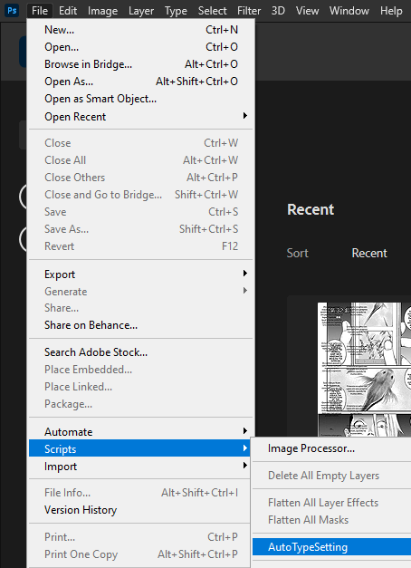

# AutoTypeSetter

AutoTypeSetter is a script that automatically creates/modifies .psd files, automatically inserting pages and text baloons, making the repetitive copy/pasting easier to do.

# Instalation

AutoTypeSetter is a photoshop plugin, meaning that all you have to do is drag and drop it into your Scripts Folder!

1. Download the [latest release](https://github.com/krevlinmen/AutoTypeSetter/releases)

2. Extract the folder from the .zip downloaded, and simply paste it on your Scripts folder.
This folder generally is located at: (Program files)\Adobe\Adobe Photoshop 2021\Presets\Scripts

3. Open Photoshop (or restart it, if it was already open), and go to File>Scripts to find your newly installed AutoTypeSetter.

# Documentation

This script was made using [Adobe Photoshop 2020 JavaScript Scripting](https://www.adobe.com/devnet/photoshop/scripting.html).

Documentation can be found on [here](https://github.com/krevlinmen/AutoTypeSetter/wiki)

# Credits

User Interface Created With https://scriptui.joonas.me/

Programmed by ImSamuka and Krevlinmen
