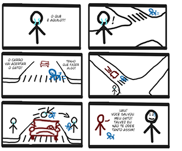
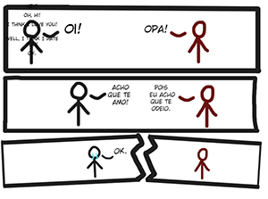
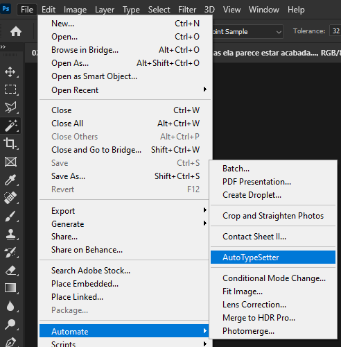

# AutoTypeSetter

AutoTypeSetter is a script that automatically creates/modifies .psd files, inserting pages and text baloons, making the repetitive copy/pasting easier to do.

# Warning! This script currently only works on Photoshop 2020 edition!

# Results

Image Input: (written in portuguese)




Text Input:
```
Art created by: Krevlinmen
Script by: Krevlinmen
Performance by: Stick men

Page 01
Hey!
Oh, hi!
I think I love you!
Well, I think I hate you!
Ok.

Page 02
What's that?
That car is going to hit the cat!
I have to do something!
Wow! Thanks for saving my cat! Maybe I don't hate you that much!
```

.psd Result:




# Instalation

AutoTypeSetter is a photoshop plugin, meaning that all you have to do is drag and drop it into your Scripts Folder!

1. Download the [latest release](https://github.com/krevlinmen/AutoTypeSetter/releases)

2. Extract the folder from the .zip downloaded, and simply paste it on your Scripts folder.
This folder is generally located at: 
(Program files)\Adobe\Adobe Photoshop 2021\Presets\Scripts

3. Open Photoshop (or restart it, if it was already open), and go to File>Automate to find your newly installed AutoTypeSetter.



- Optional: You can assign a hotkey to the program. Go to Edit>Hotkeys and, in the navigator, find the program located at File>Automate, and assign a hotkey!

- Optional: You can change the color of the button on the menu. Go to Edit>Menu and in the navigator, find the program in File>Automate, and assign a color!


# Example of Usage

Disclaimer: This is the basic usage of this script. Not all features are covered. 

1. Organize your files into a folder containing the pictures to be typesetted, and a .txt file.


1.1 The .txt file must contain the text to be inserted, each line being one text layer to be added.
You must use an identifier to separate the content of diferent files. It has to be a whole line, separating two different pages. The identifier can be anything, from ">>" all the way to "Page", and it can be placed at either the begginning or/and the end of the separating line. Also, you must insert the name of the file without the extension, to identify which file will receive which text.


2. Open AutoTypeSetter

2.1 Configure the application as you wish. You can also import configs and save your custom configuration for future sessions.

2.2 Do not forget to properly specify the page identifier!


2.3 Select the folder containing the files. You can also opt for selecting each specific file you want to use.


2.4 Finally, press OK to begin AutoTypeSetting!


# Documentation

This script was made using [Adobe Photoshop 2020 JavaScript Scripting](https://www.adobe.com/devnet/photoshop/scripting.html), which is based on [ExtendScript](https://javascript-tools-guide.readthedocs.io/index.html).

Our own documentation can be found [here](https://github.com/krevlinmen/AutoTypeSetter/wiki)


# Credits

User Interface Created With https://scriptui.joonas.me/

Created by ImSamuka and Krevlinmen
